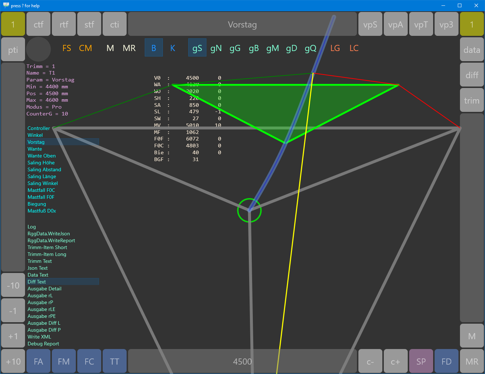
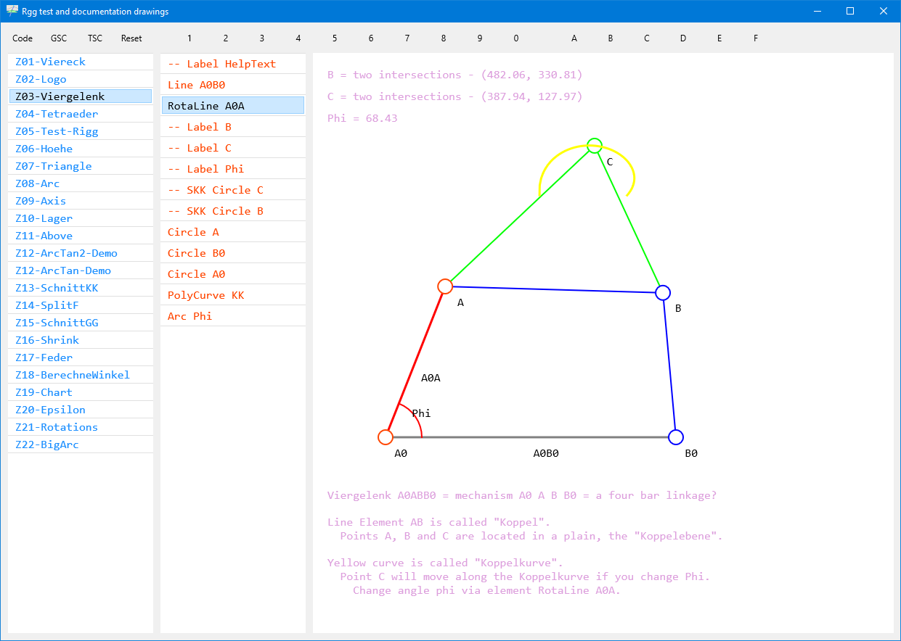

# RiggVar-RG38

```
(*
-
-     F
-    * * *
-   *   *   G
-  *     * *   *
- E - - - H - - - I
-  *     * *         *
-   *   *   *           *
-    * *     *             *
-     D-------A---------------B
-              *
-              (C) federgraph.de
-
*)
```


This is a Delphi FMX project which can be built with IDE Rio 10.3.3.

While it is a technically a Delphi cross platform project, it is intended for Windows only.

## RiggVar

The RiggVar project started in 1995.
Special versions of it have been created for several platforms and published via the app store,
but published versions were light versions that did not surface all of the original features.

I have created features as part of the original project, 1995 - 1997,
that have not been surfaced - before 2020 - in any of the published apps for iPad, Android, Mac or Windows.

While it is a good thing to have a lightweight version of the app,
and there will probably be more of them,
the intention with this repository is to rescue some of the original work,
and provide a basis for future development.

<a href="doc/images/RiggVar-RG38-01.png">*RG38 is a full featured Delphi version of the RiggVar project.*<br>
</a>

Please read about the RiggVar project ( RG ) on the federgraph website.

## Graphics

As of now, the code behind should be the same for all versions,
but the graphical display of the model can be different.
Currently there are three implementations for the Delphi platform:

1. A *close to original* version of a 2D graph, done by drawing to the Canvas.
This one can show multiple overlaid instances of the model; the current situation under load,
the relaxed situation, and a reference situation to compare with.
2. A new 2D graph implementation which is created by defining drawing elements in code, which in turn draw to the canvas.
3. A real 3D graph, not yet included in this repository.

The three implementations are called RotaForm1, RotaForm2, and RotaForm3.
RotaForm was the name of the original standalone form where you could rotate the graph around 3 axis with the mouse.

## Documentation Drawings

This project includes documentation drawings.
In FormDrawing you can select a drawing from a list and manipulate the drawing elements.
Every drawing element has a caption attached so that you know what the name of the element is,
very essential for a documentation drawing.
They could be used to produce screen shots, but it is much better: documentation drawings are live!
I recommend that you should have a look at the project,
if only to see these drawings in action.
They are supposed to be object oriented and easy to create.
You don't have to do the actual drawing, because of the drawing elements, which you create in code and add to a list.

> Documentation drawings as a sub project was only started in 2020.

There is a button with caption FD (see screenshot above) which you can use to bring up the form with the documentation drawings.

<a href="doc/images/RiggVar-FD-01.png">*Documentation drawings can serve as a unit test alternative.*<br>
</a>

With the code in folder Graph2 I have determined how the documentation should be done.
We need to add more drawings.
Then it will be easier to explain the project, by explaining the drawings, in words.

## How to build

This is a Delphi FMX project, currently using IDE 10.3.3.

Before you open the project in the IDE you need to recreate the dproj file, because it is in gitignore.
I recommend that you create a new FMX project with the name RG38 somewhere and copy the dproj file
(Delphi Project File) over to the RG38 working directory.

Once you have added the new dproj file you should be able to open the project in the Delphi IDE and run in the debugger with F9.
( Use Shift-F9 to build again after making changes. )

## How to use a build of the app

The built executable - RG38.exe - can be used standalone on any current Windows 10 machine.
There is no database, and no files are saved by default.
The app should be very easy to work with, you can run it from a USB stick.

## Download from the Store

> The name of the Windows Store application is **Trimm420**

The store entry for the app has a German language description,
but much of the text in the application is in English.
There is currently no localization, and I am not convinced there should be at this time.

## License

I have picked GPL 3.0 as a license, because I mean it,
and because I want the application to have a long life.

The *library* code for the RiggVar computations in folder Core shall always be GPL only,
and a complete application that you build with it should always have the same license.

Having made this clear, I do anticipate that it may be useful to publish the documentation drawing base classes separately under an alternative license.

Since this is a complete application, it contains a number of reusable pieces of original code, besides the computation for the RiggVar model.
Next to the documentation drawings, there is also the button frame with the integrated touch bar elements, which could be regarded as a reusable piece.
I use the button frame component in most of my Delphi applications.
Please get in contact if you want to use the button frame code for a different project under a different license.

## Contributions

Contributions are welcome. Lots of work to do.