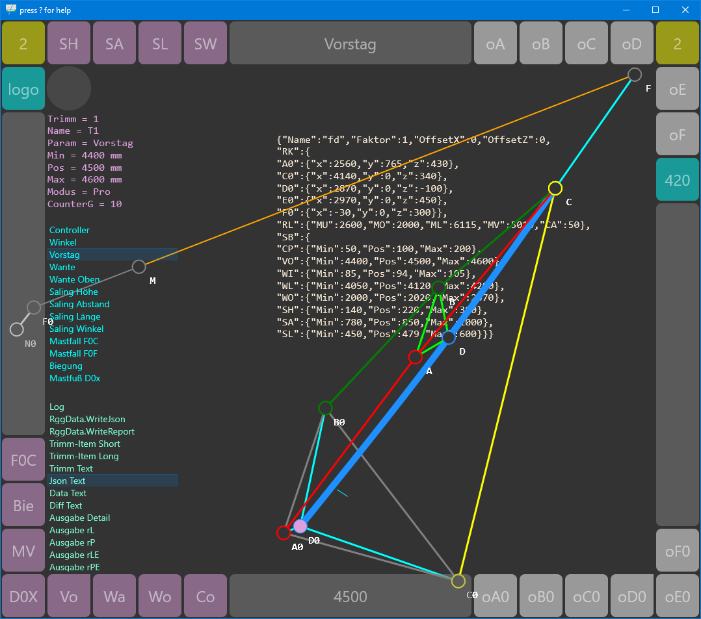

# RiggVar-RG38

```
(*
-
-     F
-    * * *
-   *   *   G
-  *     * *   *
- E - - - H - - - I
-  *     * *         *
-   *   *   *           *
-    * *     *             *
-     D-------A---------------B
-              *
-              (C) federgraph.de
-
*)
```


This is a Delphi FMX project.
While it is technically a cross platform project, it is intended for Windows only.
Lighter versions of it should compile for other targets.

## RiggVar

The RiggVar project started in 1995.
Special versions of it have been created for several platforms and published via the app store.
Published versions before 2020 were light versions that did not surface all of the original features.

The intention with this repository is to rescue some of the original work
and provide a basis for future development.

<a href="doc/images/RiggVar-RG38-01.png">*Screenshot of RG38 with RotaForm1 active.*<br>
</a>

The standard use case for the application is of educational type.
It shows how the 420 Rigg behaves in principle.
To work with concrete values for *your boat* requires more *work*.

There is some help text content about the RiggVar project ( RG ) on the federgraph website, and here in the doc folder.

## Graphics

This project has three implementations of the graphical display:

1. A *close to original* version of a 2D graph which is drawing to the canvas.
This one can show overlaid instances of the model; the current situation under load,
the relaxed situation, and a reference situation to compare with.
2. A new 2D graph implementation which is created by defining drawing elements in code, which in turn will draw to the canvas.
3. A real 3D graph.

These implementations are called [RotaForm1](doc/RotaForm1.md), [RotaForm2](doc/RotaForm2.md), and [RotaForm3](doc/RotaForm3.md).

<a href="doc/images/RiggVar-RG38-02.png">*Screenshot with RotaForm2.*<br>
</a>

**RotaForm** was the name of the original standalone form where you could rotate the graph around 3 axis with the mouse.
Now you can rotate, pan and zoom with touch screen or with touch pad as well.

## Documentation Drawings

The project includes documentation drawings.
- Button **FD** ( see picture above ) will bring up the form with the documentation drawings.
- This form can be used as the main form in a standalone application, see RG76.dpr.
- In *TFormDrawing* you can select a drawing from a list and manipulate the parameters of drawing elements with the mouse wheel.

<a href="doc/images/RiggVar-FD-01.png">*Documentation drawings can serve as a unit test alternative.*<br>
</a>

Every drawing element has a caption attached so that you know what the name of the element is.
Captions of elements can be hidden and shown interactively.
The drawings can be used to produce screen shots for the documentation.
To add a new drawing is supposed to be easy.

RotaForm2 for RG38 is based on the documentation drawings.

## How to build

The following IDE versions should be good to build the project:
- IDE 10.3 Rio
- IDE 10.2 Tokyo
- IDE 10.1 Berlin (currently used)

Please read my comments on how to [recreate the dproj](doc/How-to-recreate-the-dproj.md) file (Delphi Project File) and how to fix project options in recreated dproj file.

> For minimal project [RG03](doc/Minmal-App-RG03.md) you need set the conditional define **MinimalRG** in the project options.

## How to use a build of the app

The executable - RG38.exe - can be used standalone on any current Windows 10 machine.

There is no database and no files are saved by default.

## Download published app from the Store

The name of the Windows Store application is **Trimm420**.

## License

The *library* code for the RiggVar Model (TRigg) shall always be GPL only,
and a complete application that you build with it should always have the same license.

## Related projects

| Project | Platform | Note |
| :-- | :- | :- |
| RG03 | FMX | minimal desktop version of RG |
| RG10 | FMX | mini version of RG |
| [RG19](https://github.com/federgraph/RiggVar-RG19) | VCL | original RiggVar project |
| RG38 | FMX | Trimm 420 full project |
| [RG51](https://github.com/federgraph/RiggVar-RG51) | LCL | FPC / Lazarus project using TBGRABitmap |
| RG69 | FMX | local color test project |
| RG76 | FMX | local documentation drawings project |
| [RG79](https://github.com/federgraph/documentation-drawings) | FMX | standalone documentation drawings repo |
