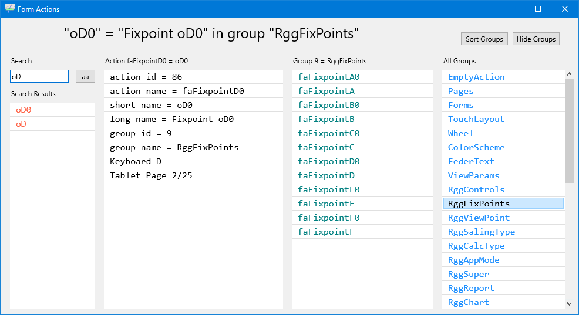

# Form Actions

Use button **FA** to bring up Form Actions.

<a href="images/Form-Actions-01.png">*Search for short captions in Form Actions.*<br>
</a>

Actions are just Integer constants in the global namespace.

- There are typically more than 256 of them.
- Numbers go from 0 to faMax -1.
- The range of numbers must be contiguous.
- You can iterate over the actions.
- Actions are partitioned into groups.
- An action is part of exactly one action group.

If you want to add a new action you have to do this:

- define the action number in unit RiggVar.FB.ActionConst.pas
- assign a unique *short caption* in unit RiggVar.FB.ActionShort.pas
- assign a *long caption* in unit RiggVar.FB.ActionLong.pas
- register the Name of the action in RiggVar.FB.ActionName.pas 
- add the action to a group in unit RiggVar.FB.ActionGroup.pas
- if new group, register the group in RiggVar.FB.ActionGroups.pas

Now you are ready to
- assign the action to a button on the button frame
- map the action to a keyboard shortcut in FormMain
- deal with the action in HandleAction methods
- deal with the action in GetChecked methods

```pascal
    procedure HandleAction(fa: Integer);
    function GetChecked(fa: TFederAction): Boolean;
```

At runtime you can use Form Actions to examine the groups
and search for actions by short caption,
as you can see in the picture above.

The list view for the details will show the assigned short cuts if any,
and the pages of the button frame where the action appears.

## Maintaining Actions

Use Form Memo to run basic checks on the defined actions
and generate code with new numbers.
This will help to maintain the contiguous range of action numbers.
You would then just paste the generated snippet of text into the unit.

```pascal
{ from RiggVar.FB.ActionConst.pas }
type
  TFederAction = Integer;

// --- generated code snippet ---
// Note that some of the defined actions
//   may not be implemented in this version of the app.

const

{ EmptyAction }
faNoop = 0;

// ...

faMax = 301;

ParamsRange = [
  faController .. faParamAPW,
  faParamEAH .. faParamEI];

ReportsRange = [faReportNone .. faReportReadme];
TrimmsRange = [faTrimm0 .. faLogo];
```

One more thing to watch out for:
If you have an additional need to use action numbers in a set,
those numbers need to be below 256.

Action numbers have served me well so far. It may appear old fashioned,
but a few things will perhaps be quite easy to do as a side effect.
For example, it should be easy to have a localized version of the captions,
short and long, without using third party code.

> Long live Form Actions and Form Memo!

As you can see, I am not using Delphi actions.

If I am *suffering* from the **not made here** syndrome - 
when will I start to feel it?
