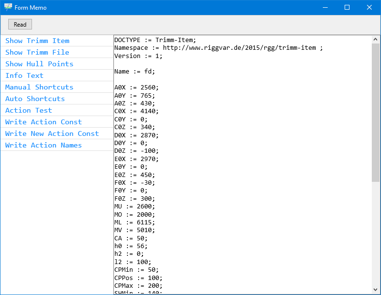

# Form Memo

Please show the Json-Text report on the main form first.
Then bring up the Memo Form with button **FM** from page 1 of the button frame on the main form.

I assume that you now see the current Trimm-Item text in the Memo on the right:

<a href="images/Form-Memo-01.png">*Form Memo with Memo and Read button* 
</a>

The **Read** button in Form Memo works with *Trimm Items* and *Trimm Files*.
By *works with* I mean that it can read text from the Memo,
which is expected to represent a Trimm-Item or a Trimm-File.

> Trimm-Item is explained in repository *trimm-420-data-format-delphi*.

Get ready for a quick test by making sure
that you can watch the graph and the report - on the main form, 
then do the test:

1. Edit the value of A0Y.
1. Press Read.

- Did you see the graph change?
- Can you identify the new value in the Json-Text report?

If so - congratulations.

More test are required to be confident that it works.

The important questions are of course:
- Where is the data going?
- Which Trimm slots are updated?
- How can it be reversed?

These are all good questions, but I will take it easy and say this:

> Reading from the Memo is like reading from a file, or pasting from the clipboard.

Instead of fiddling with files on the hard disk, you can do a lot with just the Memo.

As you can see in the list view to the left I used the Memo for other things as well.

> Delphi developers like TMemo and TStringList.