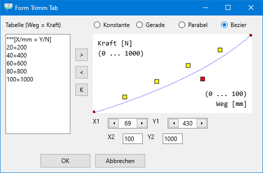

# Form Trimm Tab

Use button **TT** to bring up the form with the *Trimm-Tabelle*:

<a href="images/Form-Trimm-Tab-01.png">*Form TrimmTab with Bezier curve selected*<br>
</a>

In the screenshot above I have already
- selected the Bezier radio button and
- clicked with the mouse into the graph where the red square is shown.

> The red square in the middle is the control point for the blue Bezier curve.

Note that the yellow squares in the graph match the values in the Memo control on the left.

Now is the time to identify the *Read Memo* button and the *Write Memo* button on the form.

```pascal
type
  { see FrmTrimmTab.pas in folder App }
  TFormTrimmTab = class(TForm)
  private
    OKBtn: TButton;
    CancelBtn: TButton;

    rbKonstante: TRadioButton;
    rbGerade: TRadioButton;
    rbParabel: TRadioButton;
    rbBezier: TRadioButton;

    MemoLabel: TLabel; // Tabelle (Weg = Kraft)
    Memo: TMemo;

    Image: TOriginalImage;

    X1Label: TLabel;
    Y1Label: TLabel;
    X2Label: TLabel;
    Y2Label: TLabel;

    W2Edit: TEdit;
    K2Edit: TEdit;

    W1SpinBox: TSpinBox;
    K1SpinBox: TSpinBox;

    ReadMemoBtn: TButton; // >
    WriteMemoBtn: TButton; // <
    EvalOptionBtn: TButton; // K
  end;
```

Go ahead and do this:

- Click on **WriteMemoBtn** to update the values in the Memo.
- Click on **ReadMemoBtn** to update the yellow points in the graph.

You should now see that the yellow points lie on the curve!

Usually you would:

1. Paste measured data into the Memo.
1. Let the application read from the Memo and display the values in the graph.
1. Manipulate the blue curve to match.
1. And optionally write interpolated values back to the Memo.

This was intended to be a short intro.
I hope it will be of help when you read the code.
Search for *TTrimmTabDaten* to learn more.

## Trimm Tabelle Daten

> See *TTrimmTabDaten* in unit RggTypes.

An important thing to note is that the application was designed to persist the parameters of the blue curve instead of a list of measured values of your TrimmTab.

Currently the values are not persisted.
The new data format is a lightweight data format which does not include any material properties or force values.
The old data format did.

The goal is to use measured values for the Kraft-Weg-Kurve as a lookup table for the force in the shroud.
How to do this has been established already in the code of the application.
Just how to provide the data, and how to persist it, needs to be reviewed and agreed.
Assuming of course, that it is wanted.
This is an open source project to which you can contribute.
And of course it needs to be tested.