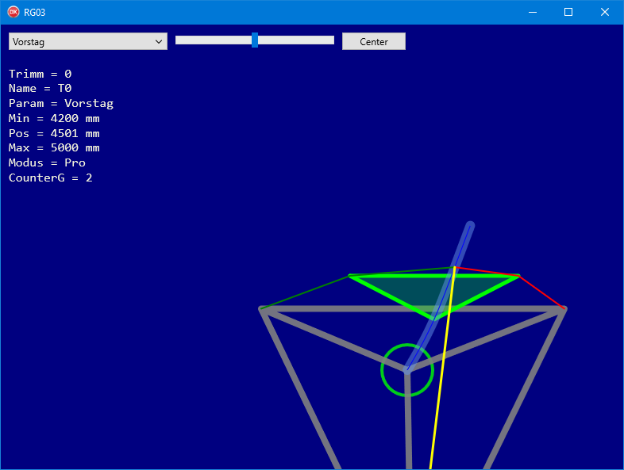
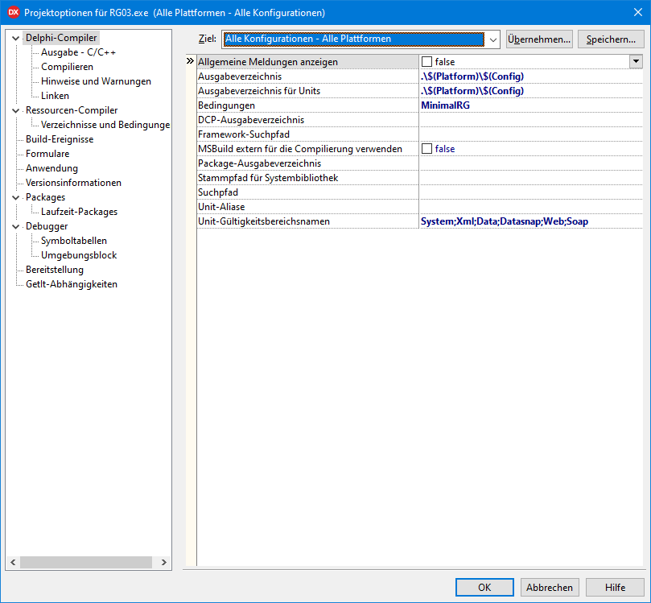
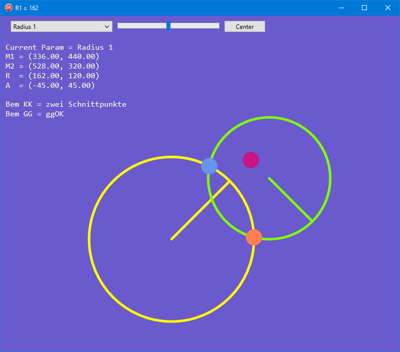

# Minimal App RG03

The minimal app is minimalistic in terms of the provided UI:
- One Combobox to select the current parameter.
- One Trackbar to change the value of the current parameter.
- One Button to reset the thumb of the trackbar to the center.
- One Text component to show minimal status info.
- One Image component to hold the graphical display.

<a href="images/RiggVar-RG03-01.png">*Minimal RG application RG03* 
</a>

## You need to configure in Project Options

To compile you need to set a *conditional define* (MinimalRG) in project options.

After the dproj file has been recreated, please make sure that the condition (Bedingung) **MinimalRG** is set for all configurations and all platforms:

Also check that Ausgabeverzeichnis is set to the default of Platform and Config,
because this is typically lost when the dproj file is recreated after cloning from GitHub.

## Use Mouse Wheel

Instead of using the trackbar you can use the mouse wheel to change the value of the current param.

The trackbar may be removed later, when it is no longer needed.

The trackbar or mouse wheel will provide a delta, positive or negative.

Absolute values for the parameter will be needed when loading persisted data,
but not when changing the model.

Constraints will be checked by the model.
The same trackbar is used for all parameters and does not need to be reconfigured when the current parameter changes, same as with the mouse wheel.
We are using the trackbar as if it was a mouse wheel.
This is why you can, at any time, reset the thumb of the trackbar to the center,
to allow further scrolling if needed.

RG38, the full-featured application, does not have a trackbar at all.
In RG38 the trackbar will be replaced by a touch sensitive rectangle which is part of the button frame.

The trackbar is useful to get started with the minimal app.

## View the Graph from any angle 

I am using **Rotaform1** without the DisplayList feature as a graph.

**Rotations** about three axis are built into the graph; just drag the mouse with left or right mouse button down.

**Panning** is also available; just grab the graph inside the green circle when dragging.

## Notes

With RG03 I have shown how to start a new application and reuse the existing model, controller, textual view (report), and graphical view.

Only the most essential use cases will be supported: Selecting a parameter as current and changing the value of the currently selected parameter. Minimal text output and the graphical display will provide enough feedback about the status of the model.

This minimal application does not surface any options for model or view.

- It will start out with default options.
- It can't load persisted data.
- You cannot even reset the model or view.
- None of the available options can be changed for model or view.

Since I am adding this minimal app on top of the existing repository of RG38, I am carrying ballast that is not needed for the minimal app.

The minimal app can be further reduced, in steps:
- Extract RG03 into its own directory.
- Remove all inactive code (undefined in RG03).
- Further remove functionality not needed.

I have done the steps here at home.

If you wanted to port the minimal app to another language and platform, to have a starting point for a new round of mobile development or similar, you probably would do this:

- Make sure you have a TStringList replacement on the target platform.
- Find a good TPoint3D replacement which is part of the platform.
- Port all of the model, because this is what you do not want to spend time on.
- Port some part of the controller (in RiggVar.RG.Main.pas).
- Redo the graphics, it can be simplified, here I used what is available.
- Of course you should create tests as you go.
- If something is wrong, you will likely see it immediately while watching the graph.

Tip: The first class that you may want to port over to a new platform is TSchnittKK in unit RiggVar.RG.Calc.

## SK03

Application SK03 can be used to test TSchnittKK within an application.

<a href="images/RiggVar-SK03-01.png">*SK03 test application* 
</a>

As a model in SK03 we have two circles.
Radius and center point coordinates are the parameters, for each of the circles,
and the graph will show the intersection points, if any.

This is very straight forward and (no argument) the absolute best possible starting point for any new development.

In case of success with porting SK03 to a new platform,
this would be a good point in time to notify me of the new development!