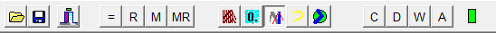
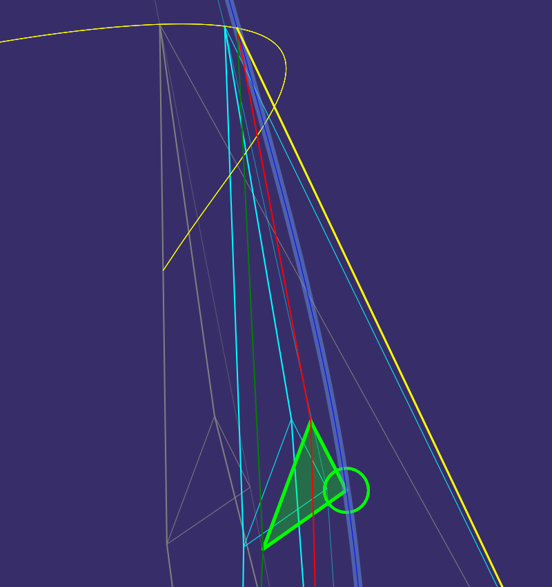

# RotaForm1

RotaForm1 is the default graphical display for the Rigg, rig, Rgg, or RG model.

```pascal
  // see RggRota.pas in folder Graph
  TRotaForm1 = class(TInterfacedObject, IStrokeRigg)
  private
    //...
  end;
```
*TRotaform1* implements a 2D graph - but note that it can be rotated about 3 axis with the mouse.
The model has 3D coordinates which will be transformed *before drawing to the canvas*.

The graph is drawn onto Image.Bitmap.Canvas
and the image component will handle OnMouseDown, OnMouseMove and OnMouseUp events.

I am using a special *TOriginalImage* component to support dragging the application between a high resolution monitor and a normal monitor.
This may be of interest to the developer.

The main purpose of this topic however is to explain the toolbar buttons for **RotaForm1**.

It is key to know about the *Sofort Berechnen* option before I can explain the buttons.
Let's do this first.

## Sofort Berechnen

FSofortBerechnen is a boolean field in TRggMain. There is also an action, faSofortBtn, to toggle it on or off. **SB** is the short caption of the action. It is mapped to a button in the button frame. The button will indicate whether the option is on or off.

Sofort Berechnen means that only *part one* of the computation is carried out inside the model code, but not *part two*. See procedure TRggMain.UpdateGetriebe;

**Part one** of the computation deals with kinematics only
and is all you need to support a basic display of the model.

**Part two** of the computation deals with forces and computes the relaxed position of the model.

Whether the force in the shrouds is bigger or smaller - you cannot see it in the graphical display.
It is therefore not necessary to do an expensive computation, if the only purpose is to show the current position of the model.

With property *Sofort Berechnen* set to False the computation completes earlier.
And of course it was important in 1995 to be fast when changing the current parameter of the model - by scrolling a scroll bar.

There used to be a corresponding button on the tool bar of the original, legacy application.

<a href="images/Sofort-Berechnen-01.png">*Old toolbar of legacy application with Automatik button A*<br>
</a>

```
var
  A: TSpeedButton; // Automatik
  FSofortBerechnen: boolean; // alias 'compute immediately'

Assert(A.Down = not SB);

// Old default was A off (speed button not down) and SB on.
// New default is Automatik on and SB off. 

{ Note the old speed button glyphs in the middle:
  BlauBtn = 0. ( zero point, the reference position )
  GrauBtn = show the relaxed position in color Gray
  KoppelBtn = show a yellow polyline for the Koppelkurve
  ZweischlagBtn = show mast as 2 lines or as curve (Bogen).
}
```
Depending on the value of Sofort Berechnen I would update the graph while scrolling - or only when scrolling ended.

Even as of today I do not use a background task to update the model.
May be in the future, but currently I am convinced that the program should do everything in the main thread.

Option Sofort Berechnen needs to be True to see the relaxed position of the model in the graph,
and/or to see updated values for the relaxed position coordinates in the textual reports.

In the current application you may see a hint line below a report:
```
--- ( updated only in mode Sofort Berechnen ) ---
```

In the old application I printed out a legend text below the reports:
```
--- Report Text went here ---

Angezeigt werden die zuletzt gültigen Werte.

 Die Tabellenwerte sind aktuell und gültig, wenn
 - die LED Grün ist und
 - die Taste "=" gedrückt wurde bzw.
 - der Schalter "A" gedrückt ist.

 Die Tabellenwerte können ungültig sein, wenn
 - die LED Rot ist und/oder
 - die Taste "=" nicht gedrückt wurde bzw.
 - der Schalter "A" nicht gedrückt ist
```
The speed panel in unit RiggVar.RG.Speed02.pas has the SofortBtn.
But the use of this speed panel is deprecated.
I think we now have something better, read on.

## Super Buttons

Now we use the speed panel defined in unit RiggVar.RG.Speed03.pas.

The new super buttons have replaced the original toolbar buttons.
They are *superimposing* the available options.
Each super button will select a predefined set of options as explained below.
Super buttons are like *radio buttons* - one of them can be down at a time.

Each graph can have its dedicated speed panel.
In the picture below you can see the speed panel used with RotaForm1.

<a href="images/RiggVar-RG38-01.png">*super buttons gS gN gG gB gM gD and gQ are on the speed panel*<br>
</a>

```pascal

// SpeedPanel01 is used for data access buttons.
// SpeedPanel02 is the old style speed panel for RotaForm1.
// SpeedPanel03 is the new version with the super buttons. 

type
  TActionSpeedBarRG03 = class(TActionSpeedBar)
  private
    ColorModeBtn: TSpeedButton;
    FontSizeBtn: TSpeedButton;

    MemoryBtn: TSpeedButton;
    MemoryRecallBtn: TSpeedButton;

    BogenBtn: TSpeedButton;
    KoppelBtn: TSpeedButton;

    SimpleBtn: TSpeedButton; // short caption = 'gS'
    NormalBtn: TSpeedButton; // gN
    GrauBtn: TSpeedButton;
    BlauBtn: TSpeedButton;
    MultiBtn: TSpeedButton;
    DisplayBtn: TSpeedButton;
    QuickBtn: TSpeedButton;

    LegendBtn: TSpeedButton;
    LineColorBtn: TSpeedButton;
```

### Super Simple

Sofort Berechnen is false in super simple mode, which is also fast.
The graph will show one positions of the model only.

### Super Normal

Sofort Berechnen will be set to true.
Otherwise it is the same as super simple.
This mode is considered the normal mode of operation.

### Super Grau

Sofort Berechnen is true and two positions of the model will be shown - 
The normal position and the relaxed position of the model, probably using a gray color.

You can see the relaxed position only if the mast bends - when the force in the shrouds is greater zero.

### Super Blau

Blau = Blue. The *memory position* used to be drawn with a light blue color known as Aqua.

When you press the Memory button **M** the program should update the reference position,
which is a set of current values for the model.
At this time the model and the reference are the same - and you cannot see the reference position
because it is drawn first, and therefore hides behind the current position.

When you *then* change the model, the reference position will become visible.

So, it is FBtnBlauDown that can be true or false, but now you will use Super Blau *action* to manipulate it.
It will ensure that FSofortBerechnen will be set.

It is time to inspect the relevant code in unit RiggVar.RG.Main.pas:

```pascal
procedure TRggMain.SetSuperRadio(const Value: TGraphRadio);
begin
  FGraphRadio := Value;
  case Value of
    gSimple:
    begin
      FSofortBerechnen := False;
      FBtnGrauDown := False;
      FBtnBlauDown := False;
    end;

    gNormal:
    begin
      FSofortBerechnen := True;
      FBtnGrauDown := False;
      FBtnBlauDown := False;
    end;

    gBlau:
    begin
      FSofortBerechnen := True;
      FBtnGrauDown := False;
      FBtnBlauDown := True;
    end;

    gGrau:
    begin
      FSofortBerechnen := True;
      FBtnGrauDown := True;
      FBtnBlauDown := False;
    end;

    gMulti:
    begin
      FSofortBerechnen := True;
      FBtnGrauDown := True;
      FBtnBlauDown := True;
    end;

    gDisplay:
    begin
      FSofortBerechnen := True;
      FBtnGrauDown := False;
      FBtnBlauDown := False;
    end;

    gQuick:
    begin
      FSofortBerechnen := True;
      FBtnGrauDown := False;
      FBtnBlauDown := False;
    end;

  end;

  // ...
end;
```

### Super Multi

True both - Grau and Blau - do you know the German color values by now?

<a href="images/Sofort-Berechnen-03.png">*gray relaxed position, blue reference position and yellow Koppelkurve*<br>
</a>

### Super Display

This will give you an alternative way of drawing, which uses *display items* that can be sorted,
so that lines in front are drawn last.

- RotaForm1  is a 2D graph.
For many years the original version of it was good enough.
- Then I published an application to the store - the FMX application -
featuring a 3D graph which some say looks better.
- Then, years later, I wanted to update the application and reintroduce features,
like for example part two of the computation, together with the 2D graph.
- And then, month later, I thought that some sort of a *painters algorithm* to improve the 3D impression would be nice,
to see what is in front.

I don't claim anything,
- whether this is worth the effort,
- whether it works in all situations,
- whether there is prove that it is in theory possible at all or may be not,
- or whether it is fast enough to be usable,

but rather I will let you decide.

You can read about the *painters algorithm* on Wikipedia,
it is more like a concept than something that can be reused easily.
I know more about the topic now, e.g why it is not easy, but I am not a mathematician
and therefore will leave it to you to analyze the situation.

### Super Quick

Super Quick is not so quick actually, it is expected to be slow!
It just means that the built in quick sort code is used to sort display items.
Sorting the drawing elements is slow compared to not sorting them.

Using quick sort with a special comparer is the more general variation of how the elements can be sorted.
It was or is not easy to get right and at one time I though it is not possible.
So I tried to do it manually, before I found another bug and now it appears as if the sorting via quick sort seems to be working.
This needs to monitored and checked again.
I have done extra test projects to be able to test out the display list approach.
I recognize that it will be difficult to do proper testing within this project.

I needed a button for this when testing.
Eventually I guess we will keep only one button, Super Display or Super Quick.

### End of Super

RotaForm2, the new one, is also a 2D graph, and it reuses the depth sorting of lines,
but it does not show the relaxed position, or the reference position.
RotaForm2 is leaner, and easier to maintain than RotaForm1.
I would rather want you to have a look at RotaForm2 and improve that one.

RotaForm3 - the 3D graph that is expected to appear in folder Graph3 in the future -
is somehow even easier, since I can use existing components for the elements,
but note that the complexity there just shifted towards other areas,
like setting up the perspective or persisting rotations.

Good news is that this project allows to use all graph implementations side by side via the interface.

Special applications that may be derived for certain platforms from this one will have to decide
- whether they want to support the computation of forces,
- what kind of graph should be used
- how data will be stored.

The most interesting part of RotaForm1 is probably not the drawing itself but how input is handled to change the view.
This differs between the views, but should perhaps be generalized and optimized.
For example, an input throttle could be applied in a consistent way across all implementations of the view.
The mouse wheel does not always have a notched behavior any more,
you may receive more mouse move messages than expected via a touch screen or a touch pad.
RotaForm3 can deal with it better because it uses OnIdle to implement a throttle.

## Legend

There is a legend in RotaForm1. It shows the order of the display items.

You can use button **LG** to see it while *display list* drawing is active.
While you are at it, also try button **LC**, it will change the color scheme used for the individual display items.
If you wanted to use alternative colors - this is the place to change colors?

Question: If you select the Super Simple mode of the graph,
and you find that the legend button and the line color button appear to do nothing,
what do you do?

Answer: Correct - you click on Super Quick, or Super Duper, done.

> The Legend is a legend.

You haven't seen the display items if you did not see the legend.
