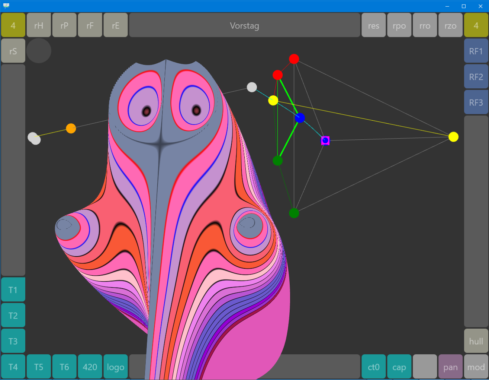

# RotaForm3

RotaForm3 is the 3D graph.

It is *disabled* by default but can be
switched on by removing the dot from the conditional define.

```pascal
{.$define WantRotaForm3}
```

<a href="images/RiggVar-RG38-03.png">*Federgraph wants RotaForm3 with Ortho.*<br>
</a>

Search in all files belonging to the project for *define WantRotaForm3* and remove or add the dot.
You should find it in two locations:

- in unit App\FrmMain.pas
- in unit Graph3\RiggVar.RG.Rota.pasS

If you are running without the 3D Graph, then you can remove all units in folder Graph3 from the project.
I have added them to the project so that you can browse the code in the IDE.

## To do List

Three improvement opportunities have been identified:

1. A device capabilities check before the main form loads - it needs RSP-18853.
1. Using the OnResizeEnd event for the Windows platform - it needs RSP-18851.
1. Introducing the orthographic projection - it needs access to the projection matrix.

( I know that it can be achieved with 10.2 Pro. )

## Special versions 

As I said in README.md: RG38 is a full featured version of the app.

It is expected that lighter versions will be derived by removing code.

> It is easier to remove code than to add code.

For example: You could build an application with RotaForm3 as the only view
and remove all code for RotaForm2 and RotaForm1.

Where should special versions be located, in permanent branches?
